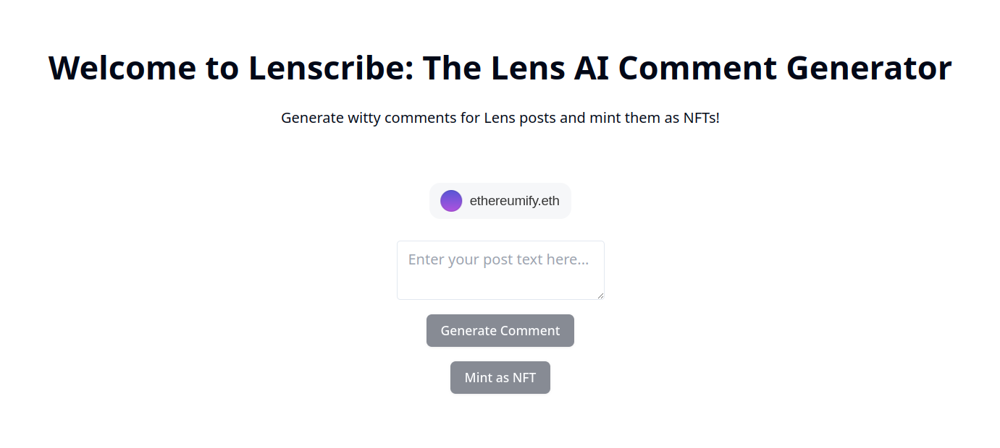

# 🤖 Lenscribe: AI-Powered Social Engagement for Lens Protocol

## 🏆 Lens Holiday Hackathon Submission - AI Agents Track

Lenscribe is an autonomous AI agent that revolutionizes social engagement on Lens Protocol by generating contextually aware, thoughtful comments and seamlessly minting them as NFTs on the Lens Network Testnet. It represents the future of intelligent social interaction in web3 social networks.



[Live Demo - Lenscribe](https://deployed-lenscribe-ofemeteng.replit.app)

[Demo Video on YouTube](https://youtu.be/HAGXZ16Dk8w)

### 🌟 Why Lenscribe Matters for Lens

In the evolving landscape of decentralized social media, meaningful engagement is crucial. Lenscribe addresses this by:

- **Intelligent Engagement**: Leverages advanced AI to understand context and generate relevant, thoughtful comments that add value to discussions
- **Permanent Value Creation**: Transforms social interactions into digital assets through NFT minting on Lens Network Testnet
- **Community Building**: Helps users craft meaningful responses that foster deeper connections within the Lens ecosystem
- **Decentralized Ownership**: Users own their generated content through NFTs, true to web3 principles

### 🚀 Key Features

- **AI-Powered Comment Generation**: Utilizes a fine-tuned LLaMA model on [Gaianet](https://www.gaianet.ai)
- **Seamless NFT Minting**: Direct minting on [Lens Network Testnet](https://dev-preview.lens.xyz/docs/network/overview) using $GRASS tokens
- **ConnectKit Integration**: Smooth web3 wallet connection experience, powered by [ConnectKit](https://docs.family.co/connectkit)
- **User-Friendly Interface**: Simple yet powerful UI for generating and minting comments
- **Autonomous Agent Capabilities**: Context-aware AI that understands social dynamics and generates appropriate responses

### 💡 Innovation Highlights

1. **AI Agent Integration**
   - Advanced prompt engineering for contextually aware responses
   - Social media expertise embedded in the AI model
   - Autonomous understanding of engagement patterns

2. **Blockchain Integration**
   - Seamless connection with Lens Protocol
   - Efficient NFT minting process
   - Integration with $GRASS token economy

### 🛠️ Technical Implementation

- **Frontend**: Next.js with App Router
- **Smart Contracts**: Solidity on Lens Network Testnet
- **AI Model**: Custom-configured LLaMA
- **Web3 Integration**: Wagmi + ConnectKit
- **Styling**: Tailwind CSS

### 📦 Installation & Setup

1. **Clone the Repository**
   ```bash
   git clone https://github.com/ofemeteng/lenscribe.git
   cd lenscribe
   ```

2. **Install Dependencies**
   ```bash
   cd frontend
   npm install
   ```

3. **Environment Setup**
   Create a `.env` file using `.env.example`:
   ```env
   NEXT_PUBLIC_WALLETCONNECT_ID=your_wallet_connect_id
   ```

4. **Start Development Server**
   ```bash
   npm run dev
   ```

5. **Smart Contract Deployment**
   ```bash
   cd contracts
   npx hardhat compile
   pnpm run deploy --network "lensTestnet"
   ```

### 🎯 How It Works

1. Connect your wallet using ConnectKit
2. Input the post you want to respond to
3. AI generates thoughtful, contextual comments
4. Choose to mint your favorite comments as NFTs
5. Pay with $GRASS tokens (0.00001 GRASS per mint)
6. Own your social interactions as NFTs on Lens Network

### 🔧 Technical Requirements

- Node.js 18+
- Web3 wallet with Lens Network Testnet configured
- $GRASS testnet tokens for minting

### 🚀 Future Roadmap

- Enhanced AI training with Lens-specific content
- Multi-language support
- Engagement analytics dashboard
- Community-driven prompt improvement
- Integration with more Lens Protocol features

### 🤝 Contributing

We welcome contributions! See our contributing guidelines for more information.

### 📫 Contact

[Lens Profile](https://hey.xyz/u/ethereumify)

---

Built with ❤️ for the Lens Protocol Community | Lens Holiday Hackathon 2024

*This project was developed as part of the Lens Holiday Hackathon, focusing on AI agents and their integration with Lens Protocol.*
